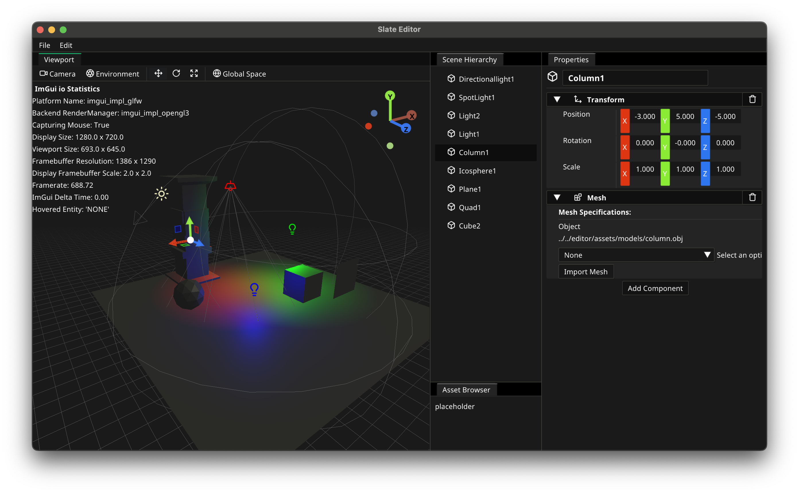

# Slate_OpenGL

A small test project of mine, unpolished and full of bugs, written in C++ 17 using OpenGL, EnTT, Dear ImGui and some other small libraries.

(As of now rewriting completely for the fun of it and it will probably be under a new repo.) (Done)

## What the editor looks like!
#### Scroll for some screenshots.

### Some viewmodes inside the editor:

<h6>Also accepts imported models.</h6>

