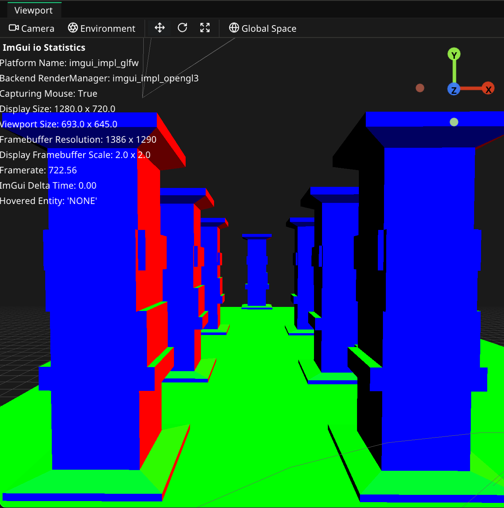

# Slate Engine & Editor

A small side project of mine, written in C++ 17 using OpenGL, EnTT, Dear ImGui and some other small libraries. 

(Rewriting completely for the fun of it.)

## What the editor looks like!
#### Scroll for some screenshots.

### Some viewmodes inside the editor:

